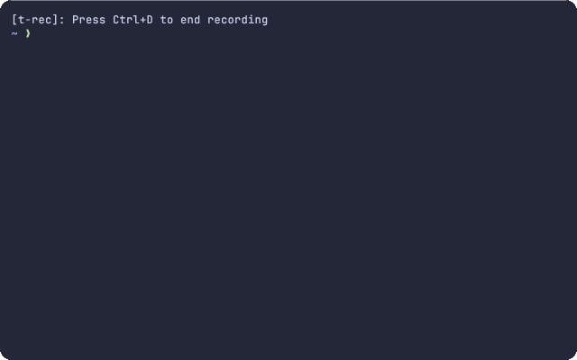

# KITTY PASSWORD MANAGER

A simple password manager for [the Kitty terminal](https://sw.kovidgoyal.net/kitty/).



## Prerequisites

Before you can use this plugin, you will need to install the following dependencies:

- [Bitwarden CLI](https://bitwarden.com/help/cli/#download-and-install)
- [fzf](https://github.com/junegunn/fzf#installation)
- [jq](https://stedolan.github.io/jq/download/)

These dependencies are necessary as the plugin uses your credentials stored in Bitwarden, fzf for interactive password selection, and jq for JSON parsing.

## Installation

Follow the steps below to install the plugin:

1. Download [password_manager.py](password_manager.py) from this repository and place the file in the same directory as `kitty.conf`.

2. Add the following snippet in your `.bashrc` or `.zshrc`, depending on your shell:

```sh
if [[ -n "${KITTY_PASSWORD_MANAGER}" ]]; then
    _bw_unlock() {
        local cache_file="${HOME}/.cache/kpm.session"

        [[ -f "${cache_file}" ]] && source "${cache_file}"

        bw unlock --check &>/dev/null

        if [[ $? -ne 0 ]]; then
            (bw login --check &>/dev/null || bw login --apikey) && bw sync -f &>/dev/null

            export BW_SESSION="$(bw unlock --raw)"

            mkdir -p "$(dirname ${cache_file})"

            echo "export BW_SESSION=\"${BW_SESSION}\"" >"${cache_file}"
        fi
    }

    _bw_enter_pw() {
        _bw_unlock

        bw unlock --check &>/dev/null

        if [[ $? -eq 0 ]]; then
            local pw=$(echo "Name\tUsername\tPassword\n$(bw list items | sed 's/ /\\u00a0/g' | jq -r 'map(select(.type == 1)) | .[] | "\(.name) \(.login.username) \(.login.password)"')" | column -t | fzf --height=100% --cycle --layout=reverse --info=inline --with-nth=1,2 --header='Select an account' --header-lines=1 | tr -s ' ' | cut -d ' ' -f 3 | sed 's/\\u00a0/ /g')

            [[ -n "${pw}" ]] && echo "${pw}" | kitty @ send-text -m id:$1 --stdin
        fi
    }

    () {
        trap 'exit' EXIT

        _bw_enter_pw "${KITTY_PASSWORD_MANAGER}"
    }
fi
```

3. Set up a key shortcut to activate the plugin in your `kitty.conf`. For example, you can use `Ctrl+Shift+Cmd+P`:

```properties
map ctrl+shift+cmd+p kitten password_manager.py
```

## Usage

Now that the installation is complete, you can start using the plugin. Whenever you are at a password prompt, simply press the key shortcut that you have defined above to activate the plugin. The plugin will prompt you to select the appropriate account and will then automatically fill in your password.

## Credits

This plugin is inspired by [Andrew Lazarus's work](https://github.com/nerdrew/kittens/blob/master/password.py).

## License

[Apache License 2.0](https://choosealicense.com/licenses/apache-2.0/)
